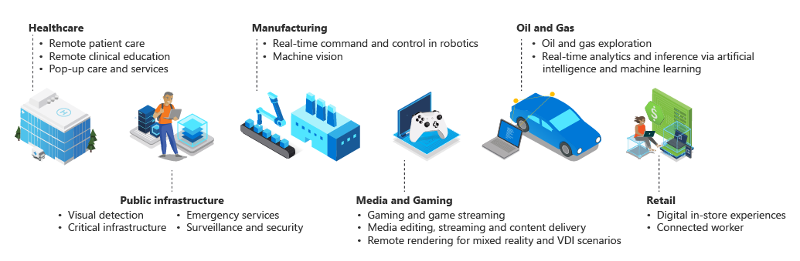
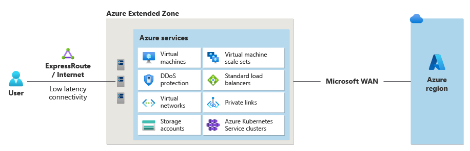

# Azure Extended Zones

This repository is the community and collaboration space for **Azure Extended Zones**.

## Code of conduct
This project follows the [Microsoft Open Source Code of Conduct](CODE_OF_CONDUCT.md).

## Documentation
- Product documentation (Learn): https://learn.microsoft.com/en-us/azure/extended-zones/
- Start here in this repo: [docs/index.md](docs/index.md)

## Getting help
- Ask questions / get help: **GitHub Discussions** (recommended)
- Bug reports: **GitHub Issues** (use the templates)
- Support and escalation: see [SUPPORT.md](SUPPORT.md)

## Contributing
Please read [CONTRIBUTING.md](CONTRIBUTING.md) before submitting issues or pull requests.

This project welcomes contributions and suggestions.  Most contributions require you to agree to a
Contributor License Agreement (CLA) declaring that you have the right to, and actually do, grant us
the rights to use your contribution. For details, visit [Contributor License Agreements](https://cla.opensource.microsoft.com).

When you submit a pull request, a CLA bot will automatically determine whether you need to provide
a CLA and decorate the PR appropriately (e.g., status check, comment). Simply follow the instructions
provided by the bot. You will only need to do this once across all repos using our CLA.

This project has adopted the [Microsoft Open Source Code of Conduct](https://opensource.microsoft.com/codeofconduct/).
For more information see the [Code of Conduct FAQ](https://opensource.microsoft.com/codeofconduct/faq/) or
contact [opencode@microsoft.com](mailto:opencode@microsoft.com) with any additional questions or comments.

# What are Azure Extended Zones?

Azure Extended Zones are small-footprint extensions of Azure placed in metros, industry centers, or a specific jurisdiction to serve low latency and data residency workloads. Azure Extended Zones supports virtual machines (VMs), containers, storage, and a selected set of Azure services and can run latency-sensitive and throughput-intensive applications close to end users and within approved data residency boundaries.
 
Azure Extended Zones are part of the Microsoft global network that provides secure, reliable, high-bandwidth connectivity between applications that run on an Azure Extended Zone close to the user. Extended Zones address low latency and data residency by bringing all the goodness of the Azure ecosystem (access, user experience, automation, security, etc.) closer to the customer or their jurisdiction. Azure customers can provision and manage their Azure Extended Zones resources, services, and workloads through the Azure portal and other essential Azure tools.

## Key scenarios

The key scenarios that Azure Extended Zones enable are: 

- **Latency**: users want to run their resources, for example, media editing software, remotely with low latency.

- **Data residency**: users want their applications data to stay within a specific geography and might essentially want to host locally for various privacy, regulatory, and compliance reasons.

The following diagram shows some of the industries and use cases where Azure Extended Zones can provide benefits.

## Availability and access

See [Request access to Azure Extended Zones](request-access.md) to learn how to request access to Extended Zones. A comprehensive list of Extended Zones will be listed in the process.

## Service offerings for Azure Extended Zones

Azure Extended Zones enable some key Azure services for customers to deploy. The control plane for these services remains in the region and the data plane is deployed at the Extended Zone site, resulting in a smaller Azure footprint.

The following diagram shows how Azure services are deployed at the Azure Extended Zones location.

The following table lists key services that are available in Azure Extended Zones:

| Service category | Available Azure services and features |
| ------------------ | ------------------- |
| **Compute** | [Azure Kubernetes Service](/azure/aks/extended-zones?tabs=azure-resource-manager)*   [Azure Virtual Desktop](/azure/virtual-desktop/azure-extended-zones)*   [Virtual Machine Scale Sets](/azure/virtual-machine-scale-sets/overview)   [Virtual machines](/azure/virtual-machines/overview) (general purpose: A, B, D, E, and F series and GPU NVadsA10 v5 series**)|
| **Networking** | [DDoS](../ddos-protection/ddos-protection-overview.md) (Standard protection)   [ExpressRoute](../expressroute/expressroute-introduction.md)   [Private Link](../private-link/private-link-overview.md)   [Standard Load Balancer](../load-balancer/load-balancer-overview.md)   [Standard public IP](../virtual-network/ip-services/public-ip-addresses.md)   [Virtual Network](../virtual-network/virtual-networks-overview.md)   [Virtual Network Peering](../virtual-network/virtual-network-peering-overview.md)   Azure Firewall (API version) |
| **Storage** | [Managed disks](/azure/virtual-machines/managed-disks-overview)   - Premium SSD   - Standard SSD   [Premium Page Blobs](../storage/blobs/storage-blob-pageblob-overview.md)   [Premium Block Blobs](../storage/blobs/storage-blob-block-blob-premium.md)   [Premium Files](../storage/files/storage-files-introduction.md)   [Data Lake Storage Gen2 Hierarchical Namespace](../storage/blobs/data-lake-storage-namespace.md)  Data Lake Storage Gen2 Flat Namespace   [Change Feed](/azure/cosmos-db/change-feed)   Blob Features   - [SFTP](../storage/blobs/secure-file-transfer-protocol-support.md)   - [NFS](../storage/files/files-nfs-protocol.md) |
| **BCDR** | [Azure Site Recovery](../site-recovery/site-recovery-overview.md)* (Extended Zone to parent region)   [Azure Backup](../backup/backup-overview.md) |
| **Arc-enabled PaaS** | [ContainerApps](/azure/extended-zones/arc-enabled-workloads-container-apps)*   [ManagedSQL](/azure/extended-zones/arc-enabled-workloads-managed-sql)* |
| **Other** | [Azure Policy](/azure/extended-zones/create-azure-policy)*   [Savings Plans](/azure/extended-zones/purchase-reservations-savings-plans)   [Reserved Instances](/azure/extended-zones/purchase-reservations-savings-plans) (through recommendations flow) |

\* While these services are GA in Azure Regions, they are currently in Preview in Azure Extended Zones.  
\** [Learn more about Virtual Machine family series here](/azure/virtual-machines/sizes/overview?tabs=breakdownseries%2Cgeneralsizelist%2Ccomputesizelist%2Cmemorysizelist%2Cstoragesizelist%2Cgpusizelist%2Cfpgasizelist%2Chpcsizelist). You can obtain a detailed VM list in the Azure Extended Zones environment. 

## Supported Independent Software Vendors (ISVs)

The following table lists the key Independent Software Vendors services that are supported in Azure Extended Zones:

| Service Provider | Supported services and features |
| ------------------ | ------------------- |
| **Aviatrix** | Cloud Native Security Fabric (CNSF) |
| **Check Point** | Firewall |
| **Fortinet** | Firewall |
| **HPE Aruba (Silverpeak)** | [Networking EdgeConnect SD-WAN](https://arubanetworking.hpe.com/techdocs/sdwan-PDFs/deployments/dg_ECV-Azure_latest.pdf) |

## Trademarks

This project may contain trademarks or logos for projects, products, or services. Authorized use of Microsoft
trademarks or logos is subject to and must follow
[Microsoft's Trademark & Brand Guidelines](https://www.microsoft.com/legal/intellectualproperty/trademarks/usage/general).
Use of Microsoft trademarks or logos in modified versions of this project must not cause confusion or imply Microsoft sponsorship.
Any use of third-party trademarks or logos are subject to those third-party's policies.
