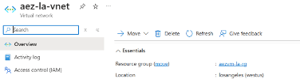
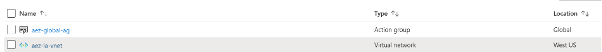

# Governance and Management

This section provides guidance on **governance** and **management** considerations for workloads deployed to **Azure Extended Zones**. It covers resource organization, policy enforcement, tagging strategies, cost management, quotas, virtual machine connectivity, image management, and update management. Where applicable, Azure Extended Zone–specific constraints and recommendations are highlighted.

## Table of Contents

- [Resource Organization](#resource-organization)
  - [Parent Region](#parent-region)
  - [Subscriptions](#subscriptions)
  - [Management Groups](#management-groups)
  - [Resource Groups](#resource-groups)
  - [Naming Conventions](#naming-conventions)
- [Governance](#governance)
  - [Azure Policy](#azure-policy)
  - [Azure Tags](#azure-tags)
  - [Cost Management](#cost-management)
  - [Quotas](#quotas)
- [Management](#management)
  - [Connecting to Virtual Machines](#connecting-to-virtual-machines)
    - [Azure Bastion](#azure-bastion)
  - [Azure Compute Gallery Images](#azure-compute-gallery-images)
  - [Azure Advisor](#azure-advisor)
  - [Update Management](#update-management)
    - [Automatic VM Guest Patching](#automatic-vm-guest-patching)
    - [Azure Update Manager](#azure-update-manager)

## Resource Organization

Resource organization within Azure necessitates a structured approach to secure, manage, and optimize cloud resources effectively. This section covers the concept of a parent region, subscriptions, management groups, resource groups, and naming conventions.

### Parent Region

As outlined in the [Overview](./Overview.md) of Azure Extended Zones, services in an **Azure Extended Zone** use a split architecture: the control plane (management layer) stays in a parent Azure Region, while the data plane (applications and data) runs in the Extended Zone. This means you must provision specific services, resources, and features in the parent region to support your Extended Zone workloads.

When deploying resources within an **Azure Extended Zone**, the resource overview will indicate the Azure Extended Zone. 



The portal views for the resource type, such as the Virtual Network View, will display the parent region.




### Subscriptions

Subscriptions are not tied to a specific Azure region or Azure Extended Zone, though each Azure resource deploys to only one region or extended zone.

Access to **Azure Extended Zones** is regulated and managed through a controlled access process. Register the subscription(s) intended for Extended Zone deployments. For more information, see the [Onboarding](./Overview.md#onboarding) section.

### Management Groups

Management groups are not tied to a specific Azure Region and can be used with both Azure Extended Zone-enabled subscriptions and Azure Extended Zone deployed resources.

### Resource Groups

Creating a resource group within an Azure Extended Zone location is not possible. Resource groups should be established with the Azure parent region. 

## Governance

### Azure Policy

**Azure Policy** assists in enforcing organizational standards and assessing compliance at scale. Through its compliance dashboard, it provides an aggregated view for evaluating the overall state of the environment, with the capability to drill down to per-resource and per-policy details. It also aids in bringing resources into compliance through bulk remediation for existing resources and automatic remediation for new resources.

**Azure Policy** is a non-regional service and will evaluate resources deployed to an **Azure Extended Zone** for adherence to assigned policy definitions.

### Azure Tags

Tags are supported within an **Azure Extended Zone** and are recommended as part of a comprehensive governance strategy for managing the Azure environment.

### Cost Management

Cost Management and billing data are available for resources deployed in Azure Extended Zones. Use tags and subscription boundaries to improve allocation and reporting for Extended Zone workloads.

Use the following practices:

- Apply consistent tags for cost center, environment, workload, and owner.
- Separate Extended Zone workloads into dedicated subscriptions when possible.
- Configure budgets and cost alerts at management group, subscription, and resource group scopes.
- Review regional and inter-region data transfer charges when telemetry or traffic crosses between the Extended Zone and parent region.

### Quotas

Quota planning is critical for Azure Extended Zones because service capacity can differ from the parent region. Validate required SKUs and quota limits before deployment.

Use the following practices:

- Validate compute, networking, and storage quota requirements during design.
- Request quota increases early if projected capacity approaches current limits.
- Track quota usage regularly to avoid deployment failures during scale events.
- Align quota monitoring with workload growth forecasts and release plans.

## Management

Azure offers a comprehensive suite of tools and services designed for effective cloud resource management. The management capabilities in Azure encompass a broad range of tasks aimed at maintaining the health, performance, and security of your applications and infrastructure. These tasks include deploying and configuring resources, monitoring their performance, and ensuring compliance with organizational policies.

### Connecting to Virtual Machines

#### Azure Bastion

To connect to a virtual machine deployed in an Azure Extended Zone, deploy **Azure Bastion** in the parent region and use Azure Bastion support for global virtual network peering. Azure Bastion Basic, Standard, and Premium SKUs support connecting to virtual machines in peered virtual networks; the Developer SKU does not. For more information, see [About Azure Bastion](https://learn.microsoft.com/azure/bastion/bastion-overview) on Microsoft Learn.

### Azure Compute Gallery Images

**Azure Compute Gallery** images serve as a valuable resource for building virtual machines within **Azure Extended Zones**. However, it is important to note that this functionality is not yet accessible through the Azure Portal (UX).

Azure Compute Gallery images hosted in a primary Azure region can be replicated to Azure Extended Zones by using the appropriate command, as demonstrated below:

```bash
az sig image-version update --resource-group MyResourceGroup --gallery-name MyGallery --gallery-image-definition PlaceholderImage --gallery-image-version 0.0.1 --target-edge-zones australiaeast=perth=1=standardssd_lrs
```

> **Note:** `premium_lrs` is also supported as a storage type for image versions in the Perth Azure Extended Zone.

If you receive an error message about `Subscription '<SubID>' is not enrolled for Edge Zone access`, please contact MSFT Support and provide your subscription ID so access to the feature can be granted on the back end. Alternatively, it is possible to self-serve this by creating a managed identity and giving it access to an Azure compute gallery via an API operation.

### Azure Advisor

**Azure Advisor** is a non-regional service that provides recommendations applicable to resources deployed in an **Azure Extended Zone**.

### Update Management

#### Automatic VM Guest Patching

Automatic virtual machine guest patching is supported for virtual machines deployed within an **Azure Extended Zone**. This feature should be considered as part of your update management strategy, adhering to the guidelines specified in the [official documentation](https://learn.microsoft.com/azure/virtual-machines/automatic-vm-guest-patching).

#### Azure Update Manager

**Azure Update Manager** is a comprehensive service designed to assist in managing and governing updates for all your machines. It provides a unified view for monitoring Windows and Linux update compliance, allowing for real-time updates or the scheduling of updates within designated maintenance windows.

Include **Azure Update Manager** in your update management strategy for virtual machines deployed in **Azure Extended Zones**.

