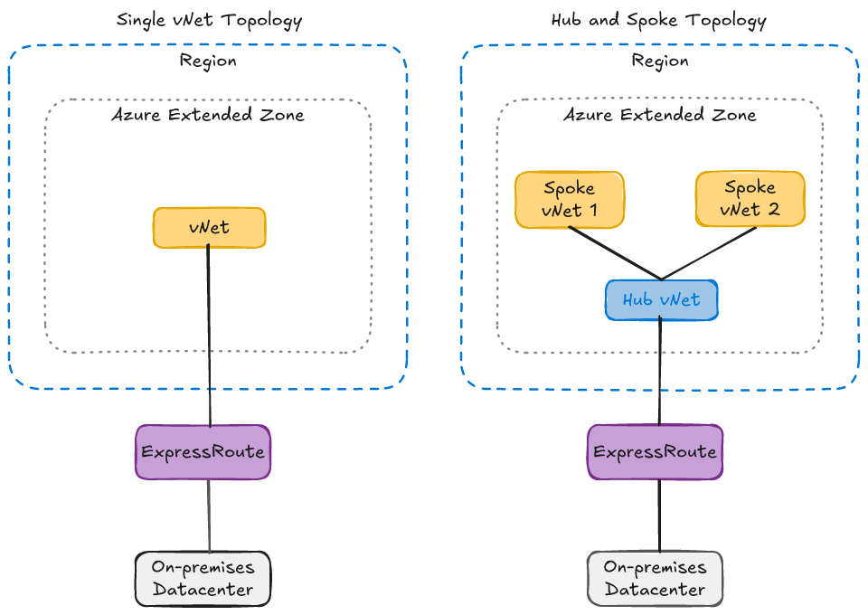
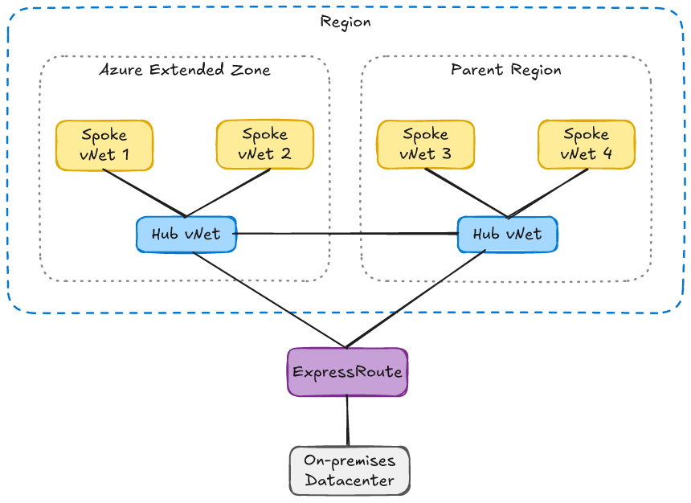
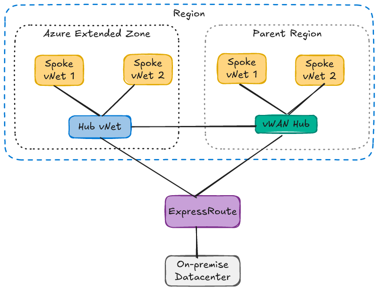
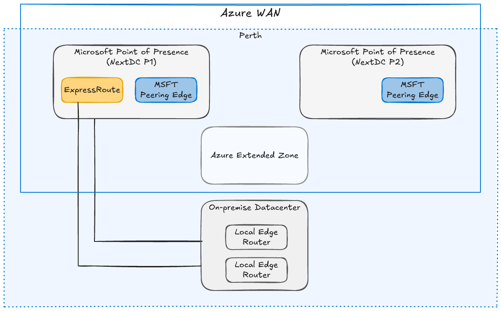
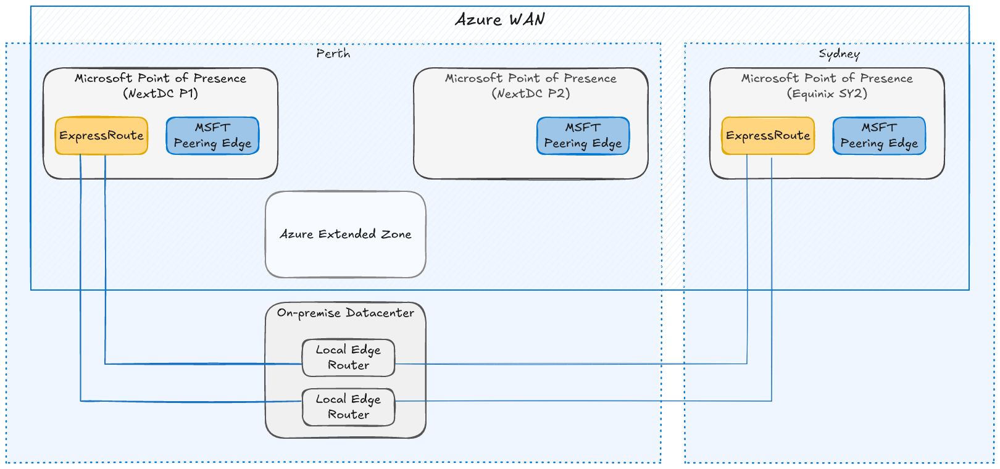
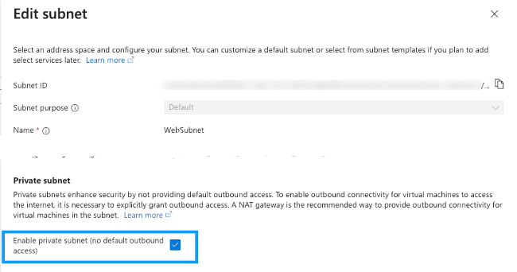
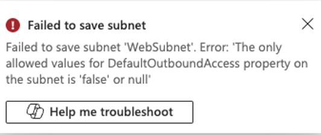
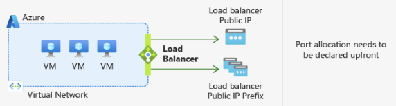
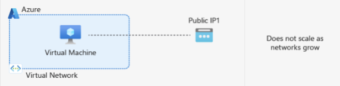
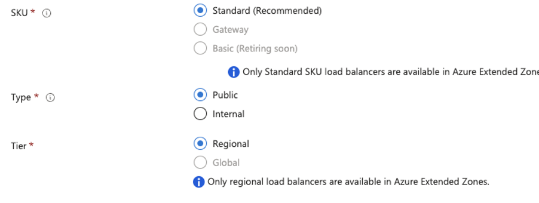

# Networking and Connectivity

Networking is a foundational component of any Azure Extended Zone deployment. This section provides guidance on designing and implementing network architectures that support workloads within an Azure Extended Zone, covering **network topology** options for both standalone and region extension scenarios, **hybrid connectivity** to on-premises environments using ExpressRoute and VPN, **inbound and outbound internet access** patterns, and **name resolution** strategies. The goal is to help organizations make informed decisions that balance performance, security, and resilience when extending their network into an Azure Extended Zone.

## Table of Contents

- [Network Topology](#network-topology)
  - [Standalone](#azure-extended-zone---standalone)
  - [Extension](#azure-extended-zone---extension)
- [Connectivity Options](#connectivity-options)
  - [ExpressRoute](#expressroute)
    - [Availability](#availability)
    - [Disaster Recovery](#disaster-recovery)
  - [Site-to-Site VPN](#site-to-site-vpn)
- [Outbound Internet Access](#outbound-internet-access)
  - [Network Virtual Appliance](#network-virtual-appliance)
  - [Azure Load Balancer](#azure-load-balancer)
  - [Instance Level Public IP](#instance-level-public-ip)
  - [Azure Firewall](#azure-firewall)
  - [NAT Gateway](#nat-gateway)
- [Inbound Internet Access](#inbound-internet-access)
  - [Azure Load Balancer](#azure-load-balancer-1)
  - [Network Virtual Appliance](#network-virtual-appliance-1)
  - [Application Gateway](#application-gateway)
- [Name Resolution](#name-resolution)
  - [Hybrid DNS Resolution](#hybrid-dns-resolution)

---

## Network Topology

Azure Extended Zones can be deployed in the following scenarios:

- Azure Extended Zone - Standalone
- Azure Extended Zone - Extension

### Azure Extended Zone - Standalone

When considering the use of an Azure Extended Zone in a standalone scenario, there are two networking topologies to consider:

- Traditional network
- Azure Virtual WAN

#### Traditional Network

Traditional Azure network topology configurations can be effectively deployed within an Azure Extended Zone. This includes configurations such as a single virtual network (vNet) or a Hub and Spoke network topology.

#### Azure Virtual WAN

> [!NOTE]
> The deployment of Azure Virtual WAN Hub within Azure Extended Zone is currently not supported.

### Azure Extended Zone - Extension

When considering the implementation of an Azure Extended Zone in a regional extension scenario, there are two primary networking topologies to evaluate:

- Traditional network
- Azure Virtual WAN

#### Traditional Network

Traditional Azure network topology configurations can be effectively deployed within an Azure Extended Zone and extended back to the parent region's network topology. Connectivity between the Extended Zone Hub vNet and the Parent Region Hub vNet will be established via a vNet Peering connection.

#### Virtual WAN (Microsoft Managed) - Hybrid

Traditional Azure network topology configurations can be effectively deployed within an Azure Extended Zone and extended back to a Parent Region Azure Virtual WAN. This connection would be established via a vNet peering connection.

> [!NOTE]
> The deployment of Azure Virtual WAN Hub within Azure Extended Zone is currently not supported.

---

## Connectivity Options

Hybrid network connectivity to resources within an Azure Extended Zone can be established through the following methods:

- ExpressRoute
- Site-to-site VPN

### ExpressRoute

ExpressRoute is the preferred solution to extend an on-premises network into the Azure Extended Zone. 

The ExpressRoute circuit are available in the following SKUs:

- **ExpressRoute Local** — currently not supported for Azure Extended Zones.
- **ExpressRoute Standard** — provides connectivity to resources within the geopolitical boundary (e.g. Oceania includes Australia East, Australia Southeast, New Zealand North).
- **ExpressRoute Premium** — provides global connectivity over the Microsoft core network, allowing you to link a vNet in one geopolitical region with an ExpressRoute circuit in another region.

> [!NOTE]
> **Perth Extended Zone** 
>
> While there are two Microsoft Points of Presence (PoP) in Western Australia, there is only a single ExpressRoute peering location that is located at Next DC P1.
>
> 
>
> The ExpressRoute circuits can be established through the following partners:
>
> - Equinix
> - Megaport
> - NextDC
>
> Or by using ExpressRoute Direct.

#### Availability

ExpressRoute is a highly reliable service, supported by a 99.95% uptime SLA. Microsoft incorporates high availability into each layer of the ExpressRoute connection, providing two separate links for each circuit, each terminating in different physical hardware inside the PoP. If the primary link becomes unavailable, the secondary link can continue to be used. Additionally, ExpressRoute PoPs are designed with a high degree of redundancy and resiliency.

High availability is a shared responsibility. Clients need to use both physical links and regularly test configuration and failover processes. Deploy your ExpressRoute configuration according to Microsoft's high availability guidance so your side of the connection is free from single points of failure. Evaluate customer premises equipment (CPE) against high availability requirements, and ensure application workloads can handle retries because short, intermittent ExpressRoute outages are normal and expected within the SLA.

#### Disaster Recovery

Instances of degradation or outages at ExpressRoute peering locations or across an entire regional service can occur, often due to natural calamities. Hence, it is crucial to develop a disaster recovery plan to ensure business continuity and support mission-critical applications.

##### Scenario: Local ExpressRoute PoP Outage

To minimize the impact of a peering location failure, the following mitigation options are recommended:

- [Deploy a second ExpressRoute circuit connecting to a PoP in the parent region](https://learn.microsoft.com/azure/expressroute/expressroute-locations) (e.g. Sydney).  While this approach may result in increased latency due to cross-region traffic, this trade-off is often considered acceptable during disaster scenarios.

- [Use a site-to-site VPN as a fallback](https://learn.microsoft.com/azure/expressroute/use-s2s-vpn-as-backup-for-expressroute-privatepeering).

Each mitigation option introduces additional complexity and expense, making it essential to carefully assess the necessity of such measures before implementation.

### Site-to-Site VPN

ISV VPN solutions can be used to establish a site-to-site VPN connection to the Azure Extended Zone to support hybrid connectivity to an on-premises network.

> [!NOTE]
> The Azure Extended Zones roadmap includes the Azure VPN Gateway service to allowing being able to send encrypted traffic between an Azure virtual network and on-premises locations over the public Internet. 
>
> Review the Service availability and timelines section for availability updates.

---

## Outbound Internet Access

> [!NOTE]
> In Azure Extended Zones, there is no default outbound internet access. As the default outbound route has been retired across all Azure regions (September 2025), Azure Extended Zones do not include a default outbound internet route.
>
>
>
> Attempts to disable the Private Subnet feature will result in the below error message.
>
> 

To provide outbound internet access, you should implement one of the following solutions:

- Network Virtual Appliance
- Azure Load Balancer (SNAT)
- Instance Level Public IP

> [!NOTE]
> 
> - Azure Firewall *(Preview)*
> - NAT Gateway *(Roadmap)*

### Network Virtual Appliance

[Network Virtual Appliances](https://learn.microsoft.com/en-us/azure/architecture/networking/guide/nva-ha) (NVA) from ISV vendors (e.g. F5 Networks, Palo Alto, Cisco) can be used in an Azure Extended Zone to:

- Inspect egress traffic from virtual machines to the internet and prevent data exfiltration.
- Inspect ingress traffic from the internet to virtual machines and prevent attacks.
- Filter traffic between virtual machines in Azure to prevent lateral movement of compromised systems.
- Filter traffic between on-premises systems and Azure virtual machines if they are considered to belong to different security levels — for example, if Azure hosts the DMZ and on-premises hosts the internal applications.

Review the [Independent Software Vendor Solutions](Overview.md#independent-software-vendor-solutions) section for a list of Extended Zone validated products.

### Azure Load Balancer

Azure Standard Load Balancer (public) can be used to provide outbound internet access via source network address translation (SNAT) for backend instances. This configuration uses SNAT to translate a virtual machine's private IP address into the load balancer's public IP address, preventing external sources from directly accessing backend instances.

### Instance Level Public IP

Assigning a public IP address to a virtual machine instance enables the instance to have direct access to the internet.

---

## Inbound Internet Access

Azure Extended Zones will offer several solutions to ensure secure access to resources from the internet:

- Azure Load Balancer
- Network Virtual Appliance

> [!NOTE]
> - Application Gateway *(Roadmap)*

### Azure Load Balancer

When using Azure Load Balancers within an Extended Zone, consider the following constraints:

- Only the [Azure Standard Load Balancer](https://learn.microsoft.com/en-us/azure/load-balancer/load-balancer-overview) SKU is supported. Gateway and Basic Load Balancer SKUs are not supported.
- Only the Regional tier is supported.

### Network Virtual Appliance

[Network Virtual Appliances](https://learn.microsoft.com/en-us/azure/architecture/networking/guide/nva-ha) (NVA) from ISV vendors (e.g. F5 Networks, Palo Alto, Cisco) can be used in an Azure Extended Zone to:

- Inspect egress traffic from virtual machines to the internet and prevent data exfiltration.
- Inspect ingress traffic from the internet to virtual machines and prevent attacks.
- Filter traffic between virtual machines in Azure to prevent lateral movement of compromised systems.
- Filter traffic between on-premises systems and Azure virtual machines if they are considered to belong to different security levels — for example, if Azure hosts the DMZ and on-premises hosts the internal applications.

---

## Name Resolution

### Hybrid DNS Resolution

Hybrid DNS resolution — which allows Azure resources to resolve on-premises domains and enables on-premises DNS to resolve Azure private DNS zones — can be implemented through the following solutions:

- Customer managed DNS server

> [!NOTE]
> - Azure Private DNS Resolver (Roadmap)

#### Customer Managed DNS Server

By deploying a [customer managed DNS server](https://learn.microsoft.com/en-us/azure/virtual-network/virtual-networks-name-resolution-for-vms-and-role-instances?tabs=redhat#name-resolution-that-uses-your-own-dns-server) into the Azure Extended Zone you will be able to:

- Resolve on-premises computer and service names from VMs or role instances in Azure.
- Resolve Azure hostnames from on-premises computers.

