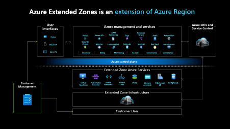
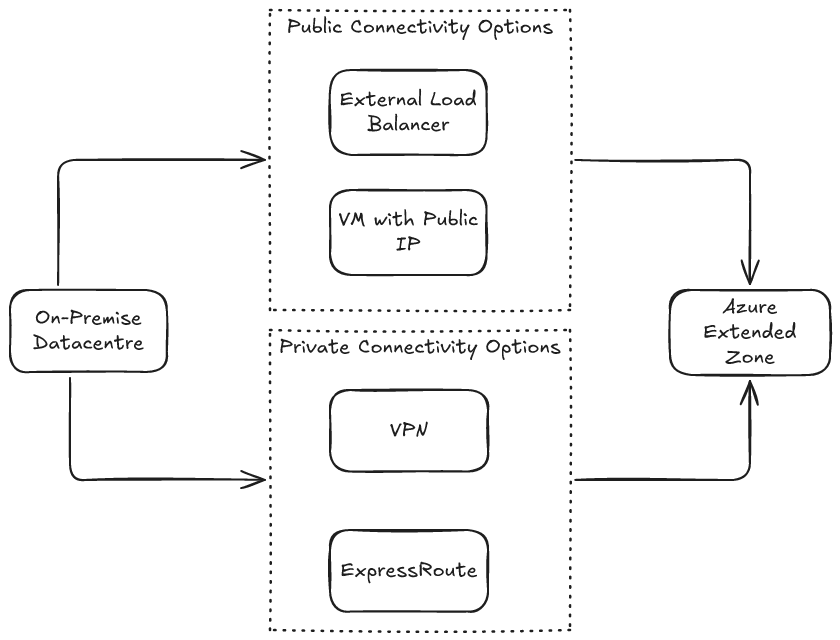
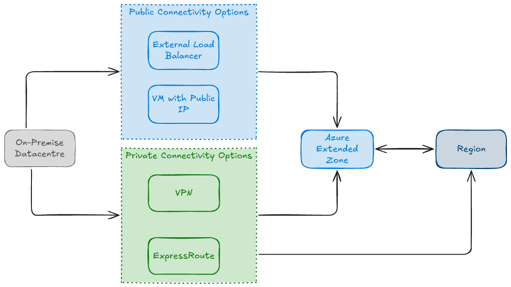

# Overview

This section provides an overview of **Azure Extended Zones**, covering **key scenarios**, **deployment considerations**, **service availability**, **SLAs**, **ISV solutions**, **pricing and billing**, and **onboarding**. It is intended to help organizations understand what Azure Extended Zones are, how they work, and what to evaluate before deploying workloads.

## Table of Contents

- [Overview of Azure Extended Zones](#overview-of-azure-extended-zones)
  - [Key Scenarios for Azure Extended Zones](#key-scenarios-for-azure-extended-zones)
  - [Deployment Considerations for Azure Extended Zones](#deployment-considerations-for-azure-extended-zones)
- [Deployment Scenarios](#deployment-scenarios)
  - [Standalone](#standalone)
  - [Region Extension](#region-extension)
- [Service Availability](#service-availability)
- [Service Level Agreement](#service-level-agreement)
- [Independent Software Vendor Solutions](#independent-software-vendor-solutions)
- [Pricing and Billing](#pricing-and-billing)
  - [Network Ingress and Egress Charges](#network-ingress-and-egress-charges)
- [Onboarding](#onboarding)

## Overview of Azure Extended Zones

[Azure Extended Zones](https://learn.microsoft.com/en-us/azure/extended-zones/overview) are small-footprint extensions of an Azure region, strategically located in metropolitan areas, industry hubs, or specific jurisdictions.

Extended Zones support virtual machines, containers, storage, and a selection of Azure services, enabling the execution of latency-sensitive and throughput-intensive applications closer to end users while adhering to approved data residency requirements.

Extended Zones are integrated into the Microsoft global network, providing secure, reliable, high-bandwidth connectivity between applications running in an Extended Zone and their users.

Azure customers can provision and manage Azure Extended Zone resources, services, and workloads through the Azure portal and other core Azure management tools.

The **control plane** for services running within an Extended Zone remains in the **parent Azure region**, while the **data plane** is deployed at the **Extended Zone site**, resulting in a **smaller Azure footprint located closer to users and workloads**.

### Key Scenarios for Azure Extended Zones

Azure Extended Zones are designed to address two primary scenarios:

1. **Latency**: Users may need to operate resources such as media editing software, real-time analytics platforms, or interactive applications remotely with minimal latency. Deploying workloads closer to end users reduces network round-trip time and improves performance.
2. **Data Residency**: Some organizations require application data to remain within a specific geographic location due to privacy, regulatory, or compliance requirements. Azure Extended Zones enable workloads and data to be hosted locally while still leveraging Azure services.

### Deployment Considerations for Azure Extended Zones

When considering the deployment of workloads to an Azure Extended Zone, the following should be evaluated.

1. What is your timeline?

    Services within Azure Extended Zones are released in phases.
    If your project has a strict delivery timeline, ensure it aligns with the service availability schedule and includes contingency time for potential delays.

    For additional information, refer to [**Service availability**](#service-availability).

2. What services will you use?

    Azure Extended Zones support:
    - Virtual Machines
    - Containers
    - Storage
    - A select range of Azure services

    Confirm whether your solution requires services that may not yet be available within the Extended Zone.

    If your architecture relies on third-party solutions from the Azure Marketplace, those services may not be available until the [independent software vendor (ISV)](#independent-software-vendor-solutions) has validated them for deployment within the Extended Zone.

    For additional information, refer to [**Service availability**](#service-availability).

3. How will your use of services grow?

    Planning for future capacity requirements is important.

    To support capacity planning for Azure Extended Zones, Microsoft monitors anticipated growth in service consumption. Organisations should discuss their expected usage patterns and future growth projections with Microsoft or their primary partner as early as possible to ensure capacity is available.

4. What are your high availability and disaster recovery requirements?

    Azure Extended Zones **do not support Availability Zones**.

    However, additional Azure services can be used to meet high availability and disaster recovery (HA/DR) requirements, such as:

    - Replication to a parent Azure region
    - Backup and recovery services
    - Cross-region failover architectures

    Designing appropriate HA/DR strategies is critical when deploying workloads in an Extended Zone.

## Deployment Scenarios

Azure Extended Zones are available for deployment in the following scenarios:

- **Standalone**
- **Region Extension**

### Standalone

Organisations can choose to deploy workloads within the Azure Extended Zone (e.g., Perth Extended Zone) without the necessity of connecting to a parent region's landing zone (e.g., Australia East).

Access to workloads within the Extended Zone can be facilitated through:

#### Private Connectivity
- **ExpressRoute**
- **Site-to-Site VPN**¹

#### Public Connectivity
- **External Load Balancer**
- **Virtual machine with a Public IP**

### Region Extension

Azure customers with existing landing zones might consider extending their presence to include Azure Extended Zones (e.g., Perth Extended Zone).

Access to workloads within the Extended Zone can be facilitated through:

#### Private Connectivity
- **ExpressRoute**
- **Site-to-Site VPN**¹

#### Public Connectivity
- **External Load Balancer**
- **Virtual machine with a Public IP**

#### Microsoft Backbone Connectivity
- **VNet Peering** to an existing landing zone in a region (e.g., Australia East), allowing traffic to traverse the Microsoft network backbone.

## Service Availability

Azure Extended Zones enable the deployment of key Azure services closer to users and workloads. The **control plane** for these services operates in the **primary Azure region**, while the **data plane** is deployed at the **Extended Zone site**, resulting in a streamlined Azure footprint.

The following diagram illustrates the deployment model of Azure services within an **Azure Extended Zone**.

The following table lists key services that are available in Azure Extended Zones:

| Service category | Available Azure services and features |
| ------------------ | ------------------- |
| **Compute** | [Azure Kubernetes Service](https://learn.microsoft.com/en-us/azure/extended-zones/deploy-aks-cluster)*   [Azure Virtual Desktop](https://learn.microsoft.com/en-au/azure/virtual-desktop/azure-extended-zones)*   Virtual Machine Scale Sets   [Virtual machines (general purpose: A, B, D, E, and F series and GPU NVadsA10 v5 series**)](https://learn.microsoft.com/en-us/azure/extended-zones/deploy-vm-portal)|
| **Networking** | DDoS (Standard protection)   ExpressRoute   Private Link   Standard Load Balancer   Standard public IP   Virtual Network   Virtual Network Peering   Azure Firewall (API version) |
| **Storage** | Managed disks   - Premium SSD   - Standard SSD   [Storage Account](https://learn.microsoft.com/en-us/azure/extended-zones/create-storage-account)   - Premium Page Blobs   - Premium Block Blobs   - Premium Files   - Data Lake Storage Gen2 Hierarchical Namespace   - Data Lake Storage Gen2 Flat Namespace   - Change Feed   - Blob Features   - SFTP   - NFS|
| Security | Key Vault |
| **BCDR** | Azure Site Recovery* (Extended Zone to parent region)   Azure Backup |
| **Arc-enabled PaaS** | [ContainerApps](https://learn.microsoft.com/en-us/azure/extended-zones/arc-enabled-workloads-container-apps)*   [ManagedSQL](https://learn.microsoft.com/en-us/azure/extended-zones/arc-enabled-workloads-managed-sql)* |
| **Other** | Azure Policy*   Savings Plans   Reserved Instances (through recommendations flow) |

\* While these services are GA in Azure Regions, they are currently in Preview in Azure Extended Zones.  
\** [Learn more about Virtual Machine family series here](https://learn.microsoft.com/en-us/azure/virtual-machines/sizes/overview?tabs=breakdownseries%2Cgeneralsizelist%2Ccomputesizelist%2Cmemorysizelist%2Cstoragesizelist%2Cgpusizelist%2Cfpgasizelist%2Chpcsizelist). You can obtain a detailed VM list in the Azure Extended Zones environment. 

Review the [Azure Extended Zone Services](https://learn.microsoft.com/en-us/azure/extended-zones/overview#service-offerings-for-azure-extended-zones) documentation for a list of services currently available.

If you plan to use an Azure Extended Zone, evaluate the services and SKUs required for your solution to confirm availability. Contact your **Microsoft account team** for guidance on:

- Expected service timelines
- Scope of availability
- Potential alternative solutions

## Service Level Agreement

Extended Zones are **single-zone locations**, meaning there is no zone redundancy or multi-zone fault tolerance available. Workloads operate within a single fault domain; the SLAs below reflect this constraint.

| Area | Service | Uptime Percentage | Service Credit at <99.9% |
|---|---|---|---|
| Compute | VM | <99.9% | 10% |
| | VMSS | <99.9% | 10% |
| Storage | Azure Premium Files | <99.9% | 10% |
| | Azure Premium Block Blobs | <99.9% | 10% |
| | Azure Premium Page Blobs | <99.9% | 10% |

For details on each Service SLA and how it's calculated, please refer to the [Microsoft SLA page](https://www.microsoft.com/licensing/docs/view/Service-Level-Agreements-SLA-for-Online-Services).

> [!NOTE]
> Please note that the Service Specific SLAs above might be different from the SLAs from the Microsoft SLA page.

## Independent Software Vendor Solutions

**Independent Software Vendor (ISV)** marketplace offerings are deployable within the Azure Extended Zone. Below is a list of ISV offerings currently undergoing validation and their respective statuses.

| Vendor | Product(s) Name | Status |
|---|---|---|
| Aviatrix | Secure Networking Platform | Completed |
| Fortinet | Fortinet FortiGate Next-Generation Firewall | Completed |
| Checkpoint | Check Point CloudGuard Network Security Firewall & Threat Prevention | ISV validating |
| Citrix | Citrix DaaS | ISV validating |
| F5 Network | F5 Big IP BYOL | ISV validating |
| NetApp | CVO | ISV validating |
| Palo Alto | VM-Series Next-Generation Firewall from Palo Alto Networks | ISV validating |
| Red Hat | Red Hat Enterprise Linux | ISV validating |

## Pricing and Billing

Azure Extended Zones usage is priced separately from Azure Regions. The services available within the Extended Zone will be offered at a premium price.

- **Enterprise Agreement (EA)** discounts will apply.
- **Cloud Service Provider (CSP)** agreements can be used for Azure Extended Zones.
- [**Cost savings plans** and **Reserved Instances**](https://learn.microsoft.com/en-us/azure/extended-zones/purchase-reservations-savings-plans) are supported.

> [!NOTE]
> Azure calculator does not currently support Azure Extended Zones.

### Network Ingress and Egress Charges

- Data Centre Data Transfer pricing is categorised as Inter-Region *(excludes transfers explicitly covered under Content Delivery Network and ExpressRoute pricing)*.
- ExpressRoute Data Transfer pricing
  -  Perth Extended Zones falls under Zone 2 classification.
- Virtual Network Peering costs for vNets peered between the Extended Zone and Parent region are treated as within the same region.

Work with your Microsoft account team to obtain detailed pricing information for the Azure Extended Zone.

## Onboarding

Access to Azure Extended Zones will be restricted and managed through a controlled access process. This process involves three primary steps:

Comprehensive guidelines on how to request access to the Azure Extended Zone can be found in the [Request access to an Azure Extended Zone](https://learn.microsoft.com/en-au/azure/extended-zones/request-access?tabs=powershell) article.

¹*Azure VPN is a roadmap item for Azure Extended Zones. Site-to-Site VPN connectivity would currently need to be implemented using a third-party solution*