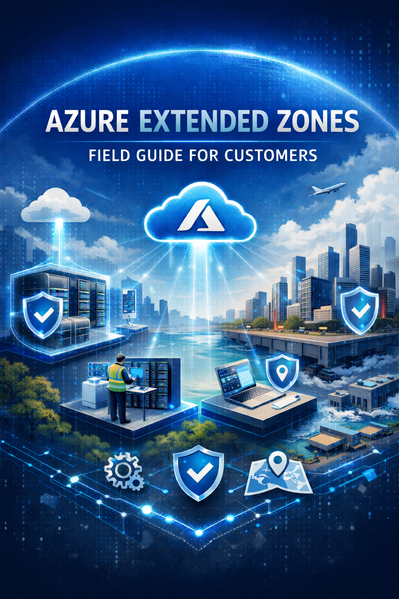

Welcome to the **Azure Extended Zones - Field Guide for Customers** which provides guidance specific to **Azure Extended Zones**, serving as an initial reference for **solution architects**, **cloud engineers**, and other **technical stakeholders** responsible for designing, deploying, or operating solutions that leverage Azure Extended Zones.

**Azure Extended Zones** are small-footprint extensions of an Azure region, strategically located in metropolitan areas, industry hubs, or specific jurisdictions. The launch of Azure Extended Zones represents a significant opportunity for organizations that require **localized data processing and storage** closer to where workloads and users reside. By enabling data to be stored and processed within the same geographic location, organizations can meet **data residency and compliance requirements**, reduce **application latency**, and support **sustainability and operational efficiency goals**.

## Table of Contents

- [**Overview**](./Overview.md) — Azure Extended Zones overview, key scenarios, deployment models, service availability, SLAs, pricing, and onboarding.
- **Design Considerations**
  - [**Networking and Connectivity**](./Networking_and_Connectivity.md) — Virtual networks, connectivity models, DNS, load balancing, and routing.
  - [**Governance and Management**](./Governance_and_Management.md) — Resource organization, policy, tagging, quotas, VM connectivity, and update management.
  - [**Observability and Monitoring**](./Observability_and_Monitoring.md) — Logging, metrics, alerting, and diagnostics.
  - [**Availability, Business Continuity, Disaster Recovery and Migration**](./Availability_BCDR_and_Migration.md) — High availability, disaster recovery, backup, and migration strategies.