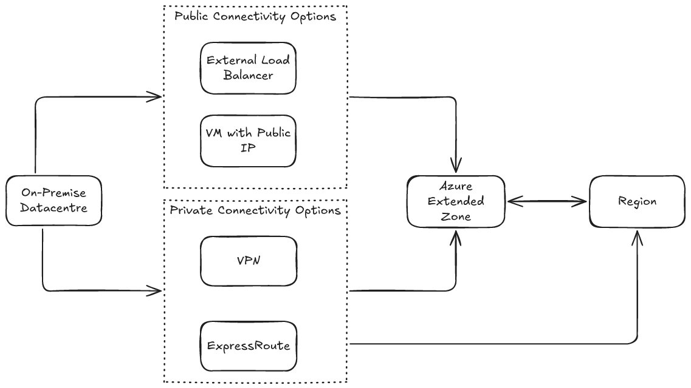
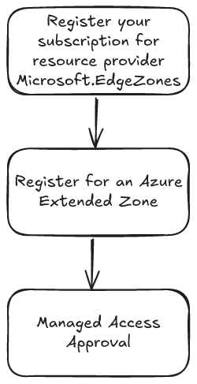

# Azure Extended Zones Overview

This section provides a comprehensive guide to **Azure Extended Zones**, covering:

- [Overview of Azure Extended Zones](#overview-of-azure-extended-zones)
  - [Key Scenarios for Azure Extended Zones](#key-scenarios-for-azure-extended-zones)
  - [Deployment Considerations for Azure Extended Zones](#deployment-considerations-for-azure-extended-zones)
- [Deployment Scenarios](#deployment-scenarios)
  - [Standalone](#standalone)
  - [Region Extension](#region-extension)
- [Service Availability](#service-availability)
- [Independent Software Vendor Solutions](#independent-software-vendor-solutions)
- [Service Level Agreement](#service-level-agreement)
- [Pricing and Billing](#pricing-and-billing)
  - [Network Ingress and Egress Charges](#network-ingress-and-egress-charges)
- [Onboarding](#onboarding)

---

[Azure Extended Zones](https://learn.microsoft.com/en-us/azure/extended-zones/overview) are **small-footprint extensions of an Azure region**, strategically located in **metropolitan areas, industry hubs, or specific jurisdictions**.

Extended Zones support **virtual machines, containers, storage, and a selection of Azure services**, enabling the execution of **latency-sensitive and throughput-intensive applications** closer to end users while adhering to approved **data residency requirements**.

Extended Zones are integrated into the **Microsoft global network**, providing **secure, reliable, high-bandwidth connectivity** between applications running in an Extended Zone and their users.

Azure customers can provision and manage Azure Extended Zone resources, services, and workloads through the **Azure portal and other core Azure management tools**.

The **control plane** for services running within an Extended Zone remains in the **parent Azure region**, while the **data plane** is deployed at the **Extended Zone site**, resulting in a **smaller Azure footprint located closer to users and workloads**.

---

### Key Scenarios for Azure Extended Zones

Azure Extended Zones are designed to address two primary scenarios:

1. **Latency**: Users may need to operate resources such as **media editing software, real-time analytics platforms, or interactive applications** remotely with **minimal latency**. Deploying workloads closer to end users reduces network round-trip time and improves performance.
2. **Data Residency**: Some organisations require application data to remain within a **specific geographic location** due to **privacy, regulatory, or compliance requirements**. Azure Extended Zones enable workloads and data to be hosted locally while still leveraging Azure services.

---

### Deployment Considerations for Azure Extended Zones

When considering the deployment of workloads to an **Azure Extended Zone**, the following should be evaluated.

1. What is your timeline?

    Services within Azure Extended Zones are released **in phases**.
    If your project has a **strict delivery timeline**, ensure it aligns with the **service availability schedule** and includes contingency time for potential delays.

    For additonal information, refer to [**Service availability**](#service-availability).

2. What services will you use?

    Azure Extended Zones support:
    - Virtual Machines  
    - Containers  
    - Storage  
    - A **select range of Azure services**

    Confirm whether your solution requires **services that may not yet be available** within the Extended Zone.

    If your architecture relies on **third-party solutions from the Azure Marketplace**, those services may not be available until the [**independent software vendor (ISV)**](#independent-software-vendor-solutions) has validated them for deployment within the Extended Zone.

    For additonal information, refer to [**Service availability**](#service-availability).

3. How will your use of services grow?

    Planning for **future capacity requirements** is important.

    To support capacity planning for Azure Extended Zones, Microsoft monitors **anticipated growth in service consumption**. Organisations should discuss their **expected usage patterns and future growth projections** with Microsoft or their primary partner.

4. What are your high availability and disaster recovery requirements?

    Azure Extended Zones **do not currently support Availability Zones**.

    However, additional Azure services can be used to meet **high availability and disaster recovery (HA/DR)** requirements, such as:

    - Replication to a **parent Azure region**
    - Backup and recovery services
    - Cross-region failover architectures

    Designing appropriate **HA/DR strategies** is critical when deploying workloads in an Extended Zone.

---
## Deployment Scenarios

Azure Extended Zones are available for deployment in the following scenarios:

- **Standalone**
- **Region Extension**

### Standalone

Organizations can choose to deploy workloads within the Azure Extended Zone (e.g., **Perth Extended Zone**) without the necessity of connecting to a parent region's landing zone (e.g., **Australia East**).

Access to workloads within the Extended Zone can be facilitated through:

#### Private Connectivity
- **ExpressRoute**
- **Site-to-Site VPN**  
  - *Note:* Azure VPN is a roadmap item for Azure Extended Zones. Site-to-Site VPN connectivity would currently need to be implemented using a **third-party solution**.

#### Public Connectivity
- **External Load Balancer**
- **Virtual machine with a Public IP**

### Region Extension

Azure customers with existing landing zones might consider extending their presence to include **Azure Extended Zones** (e.g., **Perth Extended Zone**).

Access to workloads within the Extended Zone can be facilitated through:

#### Private Connectivity
- **ExpressRoute**
- **Site-to-Site VPN**¹

#### Public Connectivity
- **External Load Balancer**
- **Virtual machine with a Public IP**

#### Microsoft Backbone Connectivity
- **VNet Peering** to an existing landing zone in a region (e.g., Australia East), allowing traffic to traverse the **Microsoft network backbone**.

¹ *Note: Azure VPN is a roadmap item for Azure Extended Zones. Site-to-Site VPN connectivity would currently need to be implemented using a third-party solution*

---

## Service Availability

Azure Extended Zones enable the deployment of key Azure services closer to users and workloads. The **control plane** for these services operates in the **primary Azure region**, while the **data plane** is deployed at the **Extended Zone site**, resulting in a streamlined Azure footprint.

The following diagram illustrates the deployment model of Azure services within an **Azure Extended Zone**.

Review the
[Azure Extended Zone Services](https://learn.microsoft.com/en-us/azure/extended-zones/overview#service-offerings-for-azure-extended-zones) documentation for a list of services currently available.

If you are planning to utilize an **Azure Extended Zone**, it is recommended to evaluate the **services and SKUs** required for your solution to confirm their availability. Contact your **Microsoft account team** for guidance on:

- Expected **service timelines**
- **Scope of availability**
- Potential **alternative solutions**

---
## Service Level Agreement

Service Level Agreements (SLAs) are Microsoft's commitment to provide a certain level of service quality, including uptime and connectivity, for their online services. These agreements capture the performance standards that customers can expect from Azure services and specify the compensation customers are entitled to if these standards are not met. In the event of an SLA breach, customers can submit claims to Microsoft. If the claim is validated, customers may receive service credits, which are applied towards future usage of the same service.

Extended Zones are single-zone locations, and the below SLAs take this into consideration.

| Area | Service | Uptime Percentage | Service Credit at <99.9% |
|---|---|---|---|
| Compute | VM | <99.9% | 10% |
| | VMSS | <99.9% | 10% |
| Storage | Azure Premium Files | <99.9% | 10% |
| | Azure Premium Block Blobs | <99.9% | 10% |
| | Azure Premium Page Blobs | <99.9% | 10% |

For details on each Service SLA and how it's calculated, please refer to the [Microsoft SLA page](https://www.microsoft.com/licensing/docs/view/Service-Level-Agreements-SLA-for-Online-Services). 

> [!NOTE]
> Please note that the Service Specific SLAs above might be different from the SLAs from the Microsoft SLA page.

## Independent Software Vendor solutions

Independent Software Vendor (ISV) marketplace offerings are deployable within the Azure Extended Zone. Below is a list of ISV offerings currently undergoing validation and their respective statuses.

| Vendor | Product(s) Name | Status |
|---|---|---|
| Aviatrix | Secure Networking Platform | Completed |
| Fortinet | Fortinet FortiGate Next-Generation Firewall | Completed |
| Checkpoint | Check Point CloudGuard Network Security Firewall & Threat Prevention | ISV validating |
| Citrix | Citrix DaaS | ISV validating |
| F5 Network | F5 Big IP BYOL | ISV validating |
| NetApp | CVO | ISV validating |
| Palo Alto | VM-Series Next-Generation Firewall from Palo Alto Networks | ISV validating |
| Red Hat | Red Hat Enterprise Linux | ISV validating |

## Pricing and billing

Azure Extended Zones usage is priced separately from Azure Regions. The services available within the Extended Zone will be offered at a premium price.

- Public Preview pricing will align with General Availability rates.
- Enterprise Agreement (EA) discounts will apply.
- Cloud Service Provider (CSP) agreements can be used for Azure Extended Zones.
- Cost savings plans and Reserved Instances are not currently supported.

> [!NOTE]
> Azure calculator does not currently support Azure Extended Zones.

### Network Ingress and Egress Charges

- Data Centre Data Transfer pricing for Perth Extended Zones, excluding transfers explicitly covered under Content Delivery Network and ExpressRoute pricing, is categorised as Inter-Region.
- ExpressRoute Data Transfer pricing for Perth Extended Zones falls under Zone 2 classification.
- Virtual Network Peering costs for vNets peered between the Perth Extended Zone and Australia East are treated as within the same region.

Work with your Microsoft account team to obtain detailed pricing information for the Azure Extended Zone.

## Onboarding
Access to Azure Extended Zones will be restricted and managed through a controlled access process. This process involves three primary steps:

Comprehensive guidelines on how to request access to the Azure Extended Zone can be found in the [Request access to an Azure Extended Zone](https://learn.microsoft.com/en-au/azure/extended-zones/request-access?tabs=powershell) article.
